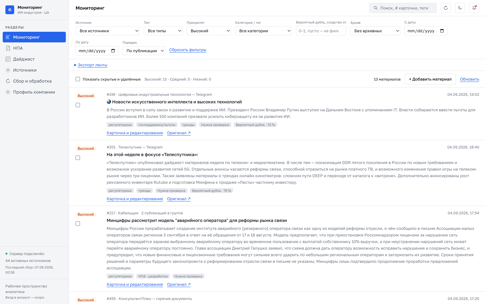

# news-digest

[](https://github.com/youngwow/news-digest/actions/workflows/ci.yml)

Новостной мониторинг для одного читателя. Собирает посты из Telegram-каналов (а также RSS, sitemap
и HTML-страниц), склеивает перепечатки, прогоняет каждое событие через LLM — саммари, сущности,
рубрика, приоритет относительно профиля читателя — и отдаёт результат тремя способами: лентой в
веб-интерфейсе и HTTP-API, Telegram-дайджестом по расписанию и алертами сторожа, если конвейер
сломался.



## Что внутри

- **Источники.** Шесть Telegram-каналов по умолчанию (`sources.json`): Фонтанка, Хабр, Data Secrets,
  Т—Ж, Investnique, AI News. Каналы читаются через MTProto (после `telegram login`) или через
  веб-превью `t.me/s/`; любой сайт добавляется одной ссылкой — резолвер сам находит RSS, sitemap
  или переходит на HTML-diff.
- **Дедупликация до модели и после.** URL → SimHash-64 по 3-граммам → косинус локальных
  эмбеддингов (`ai-sage/Giga-Embeddings-instruct`): пятнадцать перепечаток дают одну карточку и один
  вызов модели. После прогона HDBSCAN по саммари находит дубли, которые S1 пропустил, и предлагает
  их объединить — решает человек.
- **Карточки.** Один structured-output вызов на кластер (Ollama Cloud, GLM-5.3): тип, сущности
  «кто / что / когда / последствия», саммари с координатами доказательств в тексте, приоритет,
  рубрики из настраиваемого словаря. Ответ проверяется по схеме в коде, пограничный приоритет
  повышается, без модели карточка собирается экстрактивно и помечается `degraded`.
- **Лента.** FastAPI (`/api/v1`, схема на `/docs`) и дашборд на Vue 3: фильтры, полнотекстовый
  поиск, курсорная пагинация, правки аналитика с историей, скрытие, архив, заметки, RSS/CSV-выгрузка.
- **Дайджест в Telegram.** «Главное → рубрики → остальное» из карточек, которых читатель ещё не
  видел; продолжения уже доставленных историй помечаются 🔄; каждая отправка запоминается.
- **Эксплуатация.** `run` для cron с локом и гейтингом шагов, `watchdog` с ALERT-блоком и
  подавлением повторов, `dataset` — накопленная разметка для маленького локального классификатора.

Проект начинался как личный RSS → LLM → Telegram дайджест; текущий код обновлён на базе версии,
написанной во время хакатона (командный кейс, репозиторий команды —
[youngwow/ai-analytics-hub](https://github.com/youngwow/ai-analytics-hub)).

## Быстрый старт

```bash
uv sync                                    # зависимости в .venv (Python 3.13 из .python-version)
cp .env.example .env                       # OLLAMA_API_KEY — модель; TELEGRAM_API_* — MTProto; TELEGRAM_BOT_* — доставка
uv run python -m src sources seed          # шесть каналов из sources.json
uv run python -m src collect               # один проход по источникам
uv run python -m src process               # карточки: саммари, рубрика, приоритет (нужен OLLAMA_API_KEY)
uv run python -m src digest --format telegram   # дайджест на stdout; --send — в чат
uv run python -m src serve                 # HTTP-API на 127.0.0.1:8000, схема на /docs
cd frontend && npm ci && npm run dev       # дашборд на 127.0.0.1:5173, /api проксируется в API
docker compose up --build                  # то же в контейнерах: API :8000, фронтенд :8080
```

Одной командой для cron — `./run.sh`: сбор → обработка → дайджест (в чат при
`telegram.deliver: true`, иначе на stdout). `make install | seed | collect | process | serve | run |
watchdog | digest | deliveries | dataset | test | lint` — те же команды.

```cron
0 */6 * * * /path/to/news-digest/run.sh >> /var/log/news-digest.log 2>&1
*/30 * * * * /path/to/news-digest/pipeline_check.sh
```

## Как устроено

```
sources.json ─► resolver ─► kind (telegram | rss | sitemap | html | search)
                                    │
collect ──► ThreadPool ──► adapter.fetch() ──► RawDocument[] ──► dedup ──► fulltext ──► SQLite
             (MTProto / t.me/s/, RSS, sitemap, HTML)            (main thread, транзакция на источник)

process ──► S0 нормализация ──► S1 SimHash + косинус на numpy ──► кластер
                                       │        (эмбеддинги — локальная модель)
            один вызов модели на кластер (тип, сущности, саммари, приоритет, рубрики)
                                       │
            разбор и проверка ответа ──► items + entities + item_sources (транзакция на кластер)
                                       │
            эмбеддинги саммари свежих карточек ──► HDBSCAN ──► «вероятный дубль — объединить?»

digest ──► карточки без доставки ──► главное / рубрики / остальное ──► 🔄 по косинусу с доставленными
                                       │
                                  Bot API (сообщения ≤ 4096) ──► digest_deliveries

serve ──► FastAPI: /api/v1/{items, documents, sources, processing, collection, profiles, digest, export, health}
frontend ──► Vue 3 + TypeScript + Tailwind, dev-прокси /api → :8000
watchdog ──► collect_runs, fetch_state, processing_runs, digest_deliveries ──► ALERT (+ Telegram)
```

Слои: `src/api/routes` (тонкие маршруты) → `src/services` (вся логика, одна на CLI и HTTP) →
`src/repositories` (SQLite, миграции по `PRAGMA user_version`, сейчас v9) → `src/models`
(dataclass'ы домена, pydantic только на HTTP-границе). Подробно — в разделе «Модули» и в
`docs/architecture.md`.

## Команды

| Команда | Что делает |
|---|---|
| `run [--limit N] [--no-collect] [--no-process] [--no-digest] [--no-deliver]` | Один запуск для cron под локом: сбор → обработка → дайджест. Упавший сбор не запускает обработку, упавшая обработка — дайджест; деградация (модель недоступна) дайджест не отменяет. Код выхода 0 / 2 (деградация) / 1 |
| `collect [--source ID] [--backfill] [--force] [--watch --interval S]` | Опрос источников: MTProto или веб-превью для Telegram, условный GET для RSS, `lastmod` для sitemap. `--backfill` листает историю, `--force` сбрасывает ETag/курсоры |
| `process [--limit N] [--source ID] [--since ISO] [--profile ID] [--force] [--dry-run] [--only-failed]` | Обработка документов без карточки: нормализация, кластеризация, один вызов модели на кластер. Каждый прогон пишется в `processing_runs` |
| `digest [фильтры] [--format markdown\|json\|telegram] [--undelivered] [--send] [--record] [--out FILE]` | Дайджест среза. `telegram` — текст для чата; `--undelivered` — только не доставленное; `--send` отправляет через бота и записывает доставку; `--record` записывает без отправки |
| `deliveries [id] [--limit N]` | История отправленных дайджестов; с `id` печатает текст заново |
| `watchdog [--json]` | Здоровье конвейера по порогам `health`: тишина, если всё хорошо, иначе ALERT-блок (и Telegram при `telegram.alerts`) |
| `status` | Когда собирали, сколько без карточки, какие источники просрочены |
| `items [--q …] [--type] [--priority]… [--tag]… [--source ID]… [--from] [--to] [--order] [--duplicate [SIM]] [--cursor]` | Лента: фильтры комбинируются, поиск по карточке, тегам, сущностям и тексту оригинала; `--duplicate 80` — только вероятные дубли со сходством ≥ 80 % |
| `item <id>` / `edit <id> …` / `reprocess <id>` / `revert <id> --field …` / `revisions <id>` | Карточка целиком; правка аналитика (поле не перезаписывается переобработкой); переобработка; возврат версии модели; история правок |
| `hide <id...> [--scope feed\|digest]` / `unhide` / `note <id> --text …` | Скрыть из ленты или из следующего дайджеста; вернуть; заметка аналитика (в модель не уходит) |
| `merge <id> <другие…>` / `not-duplicate <id>` / `dedup` | Подтвердить или отклонить «вероятный дубль»; пересчитать предложения по окну |
| `sources add <url> [--name] [--category] [--kind --fetch-url]` / `list` / `probe <url>` / `health <id>` / `enable` / `disable` / `pause` / `resume` / `refresh` / `remove` / `restore` / `seed [file]` | Управление источниками: резолвер сам решает, чем тянуть ссылку; `probe` показывает превью без сохранения; `seed` загружает `sources.json` |
| `telegram login / status / logout --yes` | Сессия MTProto: разовый вход (телефон, код, 2FA), проверка, удаление. Без сессии каналы читаются через веб-превью |
| `search "<запрос>" [--domains …] [--days N] [--save]` / `discover "<запрос>" [--add]` | Материалы и источники через Tavily (нужен `TAVILY_API`) |
| `profile show \| list \| use <id> \| set <file.json>` | Профиль читателя, относительно которого считается приоритет; `set` сохраняет новую версию |
| `add-item [--url …] --title … [--no-llm]` / `import-url <url>` | Материал вручную; разовый импорт страницы |
| `quality [--from] [--to] [--gold] [--pairs [--grid]]` / `dataset [--out FILE] [--since ISO]` | Метрики обработки; золотой набор; калибровка дедупликации; выгрузка размеченных карточек в JSONL |
| `serve [--host] [--port] [--reload]` | HTTP-API (uvicorn, фабрика `src.main:create_app`), документация на `/docs` |

## Источники

`sources.json` — стартовый пул, `sources seed` заводит его в базу; дальше источники живут в базе и
управляются командами или дашбордом. По умолчанию — шесть Telegram-каналов: Фонтанка (Петербург),
Хабр (разработка), Data Secrets (ML/ИИ), Т—Ж (личные финансы), Investnique (инвестиции), AI News
(индустрия ИИ). Схема записи: `name`, `url`, `kind` (`telegram | rss | sitemap | html | search`),
`fetch_url`, `category` (`media | regulator | telegram`), `enabled`, `notes`.

**Ссылку не нужно разбирать руками.** `sources add https://example.ru` гоняет её через резолвер:
`t.me/<канал>` → прямой RSS → `<link rel=alternate>` → типовые пути → sitemap с `lastmod` → HTML-список
страницы. `sources probe <url>` показывает, что получится, ничего не сохраняя: тип, адрес ленты,
превью последних материалов и предупреждения (`paywall_suspected`, `bot_protection`, `empty_feed`).
Три написания одного канала (`t.me/x`, `t.me/x/`, `t.me/s/x`) — один источник.

**У каждого источника своя периодичность** (15 минут, час, 6 часов, сутки; `PATCH /api/v1/sources/{id}`).
Падающий источник опрашивается реже — интервал удваивается за каждую неудачу подряд, первый успех
возвращает ритм; молчащий неделю уходит в паузу с причиной в примечании. Каждый опрос попадает в
историю (`sources health <id>`): когда, сколько нашлось, машинный код ошибки — так «источник молчит»
отличается от «источник сломался неделю назад».

### Telegram: MTProto или веб-превью

Каналы читаются двумя способами, тип источника у обоих один — `telegram`, номера постов
совпадают, поэтому переключение транспорта не приводит ни к повторному импорту, ни к дублям.

| | `t.me/s/<канал>` | MTProto (Telethon) |
|---|---|---|
| Что нужно | ничего | `api_id`/`api_hash` с [my.telegram.org](https://my.telegram.org) и один вход |
| Каналы без веб-превью | не читаются | читаются |
| Догоняние | до 5 страниц `?after=` за проход | `telegram.max_posts` за проход, `backfill_posts` при `--backfill` |
| Вложения | ссылки `t.me` | имена файлов (`file:<имя>` в `attachments`); сами файлы не скачиваются |

```bash
uv run python -m src telegram login     # телефон → код из Telegram → пароль 2FA, если включён
uv run python -m src telegram status    # ключи, файл сессии, аккаунт, режим
uv run python -m src collect            # Telegram-источники пойдут через MTProto
```

`telegram.mtproto` в `config.yaml`: `auto` (MTProto при наличии сессии, иначе превью), `off`
(только превью), `only` (без сессии источник падает с ошибкой). В режиме `auto` ошибка по одному
каналу откатывает на превью, а проблема с самой сессией отключает MTProto до конца прогона.

Файл сессии `data/telegram.session` — это доступ к аккаунту: он в `.gitignore`, его нельзя
коммитить и пересылать. Чтение пассивное: каналы не подписываются, посты не помечаются
прочитанными, одновременных запросов не больше `telegram.concurrency` (по умолчанию 2).

### Поиск через Tavily

`search` дополняет ленты, а не заменяет их: западные поисковые API плохо индексируют gov.ru и
нишевые российские СМИ, поэтому качество ответа сильно зависит от `--domains`. Что происходит:

1. Запрос сохраняется как источник `tavily://search?q=…&domains=…&days=N&topic=news|general&summary=1`
   (одинаковый запрос → тот же источник).
2. Первый запуск и `--force` берут последние `N` дней; следующие `collect` — только то, что появилось
   после предыдущего опроса (`start_date`).
3. Каждое попадание — обычный документ: текст со страницы, которую вернул Tavily (или дотянутый
   trafilatura), дата публикации (для `news`). Ответ Tavily по запросу — документ «Сводка: <запрос>»,
   один в день; `tavily.language: ru` в `config.yaml` просит ответ по-русски (Tavily соблюдает это не всегда).
4. `include_answer=advanced` и `search_depth=advanced` стоят дороже базового кредита.

## Обработка: саммари, рубрика, приоритет

`collect` наполняет `documents`, `process` превращает их в карточки ленты (`items`).

```bash
uv run python -m src process --limit 20     # обработать 20 свежих документов
uv run python -m src items --priority high  # что читать первым
uv run python -m src item 42                # карточка целиком
```

Что происходит с каждым документом:

1. **Нормализация.** Чистка HTML и служебных строк; результат хранится в `documents.norm_text`,
   потому что `evidence_offsets` считаются именно по нему.
2. **Дедупликация.** URL → SimHash по 3-граммам → косинус по эмбеддингам, но только среди
   кандидатов за последние 7 дней. 15 перепечаток одной новости дают одну карточку и **один**
   вызов модели, а не пятнадцать.
3. **Один structured-output вызов** на кластер: тип, сущности, саммари, приоритет и рубрики сразу.
   Схема уходит провайдеру параметром `format` и продублирована текстом в системном промпте —
   Ollama Cloud структурированный вывод пока игнорирует.
4. **Разбор и проверка ответа.** Тип, размер саммари, диапазоны чисел, рубрики из словаря и ссылки
   на текст проверяются в коде; почти-JSON чинится `json_repair`; не прошедший проверку ответ — один
   корректирующий повтор, затем экстрактивный baseline. Два честных признака вместо сверки с
   оригиналом: `needs_review` при пограничной релевантности или низкой уверенности и
   `evidence_start/end` у сущностей, найденных в тексте дословно.

**Приоритет считается относительно профиля читателя** (`profile show`): сфера интересов, ключевые
темы, регуляторы и, что важнее, `negative_facets` — чем читатель не интересуется (реклама и
промокоды, спорт, светская хроника). Профиль по умолчанию соответствует стартовому пулу каналов:
ИИ и данные, разработка, инвестиции и личные финансы, Петербург; `profile set <file.json>`
сохраняет свою версию — каждая карточка помнит, какой версией её судили. В пограничной зоне
(`relevance_score` 0.35–0.5) или при низкой уверенности приоритет **повышается** на ступень: пропустить
важное дороже, чем показать лишнюю карточку.

**Рубрики — словарь в `config.yaml` → `categories`**: он же enum тегов в схеме ответа модели, список
в фильтре ленты и группы дайджеста. Первый тег карточки — её рубрика. По умолчанию: ии, технологии,
финансы, экономика, политика, петербург, общество, наука, культура, прочее — с эмодзи и подписями
для дайджеста; свой набор задаётся там же, без правок кода.

**Если модель недоступна**, лента не пустеет: карточка собирается экстрактивным baseline'ом
(первые предложения, `priority = medium`), помечается `degraded`, и `process` возвращает код 2.
Повторный прогон переберёт такие документы заново.

**Правки аналитика не затираются.** `edit` помечает поле в `manual_overrides`, и `reprocess` его
не трогает; каждое изменение попадает в историю (`item_revisions`). Заметки живут отдельно от
саммари (`note <id> --text …`, таблица `item_notes`) и никогда не уходят в модель — это проверяется
отдельным тестом.

Ключ модели — `OLLAMA_API_KEY` в `.env` (ollama.com → Settings → Keys), модель и хост — в
`config.yaml`, секция `llm`. Тег модели должен совпадать с облачным буквально
(сейчас `glm-5.3-flash`). Переезд на другого провайдера меняет только реализацию `LLMProvider`.

## Эмбеддинги и дубли карточек

Косинус в S1 считается по **локальной** модели эмбеддингов: `ai-sage/Giga-Embeddings-instruct`
(sentence-transformers, ~3 млрд параметров, 2048 измерений, лицензия MIT) грузится на этой
машине, ключ и сеть после первой загрузки не нужны. Векторы нормируются по L2 сразу в провайдере,
поэтому косинус дальше — это скалярное произведение. Облачные эмбеддинги остались как явный выбор.

```yaml
embeddings:
  provider: local          # local | ollama | off
  model: ai-sage/Giga-Embeddings-instruct
  device: auto             # auto | mps | cuda | cpu — auto: cuda → mps (Apple Silicon) → cpu
  dtype: auto              # auto | bfloat16 | float16 | float32 — auto: bfloat16 на ускорителе, float32 на cpu
  batch_size: 16
  max_seq_length: 1024     # токенов на текст; S1 и так режет текст до 2000 символов
  dimensions: 2048         # ожидаемая длина вектора; 0 — не проверять
  prompt: "Instruct: Retrieve news that report the same event\nQuery: "   # инструкция, одна для обеих сторон
```

- `provider: local` — модель sentence-transformers на этой машине (первая загрузка скачивает
  ~14 ГБ весов в `~/.cache/huggingface`; в памяти в bfloat16 — около 7 ГБ). `flash_attention_2` не
  включается: он только для CUDA и ломается на MPS.
- `provider: ollama` — прежний облачный путь: `llm.host`, `llm.embed_model`, ключ `OLLAMA_API_KEY`.
  Без ключа провайдер не собирается, и это ошибка в логе, а не тихая деградация.
- `provider: off` — эмбеддингов нет по решению оператора: S1 работает по URL и SimHash.
- **MPS из контейнера недоступен:** Docker Desktop на macOS запускает Linux-VM без доступа к GPU
  Apple, поэтому в контейнере `device: auto` честно выбирает `cpu`, и никакой настройкой это не
  изменить. Чтобы эмбеддинги считались на MPS, API должен работать на хосте: `make serve`
  (`uv run python -m src serve`) плюс фронтенд через `cd frontend && npm run dev` — dev-сервер Vite
  проксирует `/api` на `127.0.0.1:8000`. Docker остаётся для случаев без локальной модели.
- **В Docker** ускорителя нет: модель идёт на CPU в float32 и занимает ~12 ГБ памяти (в bfloat16 —
  ~7 ГБ, но на CPU это заметно медленнее: `dtype: bfloat16`). `docker-compose.yaml` монтирует кэш
  Hugging Face (`~/.cache/huggingface`, переопределяется `HF_HOME`), чтобы веса не качались заново
  при каждой пересборке. Если памяти контейнеру не хватает — `provider: ollama` или `provider: off`.
  `hdbscan` не публикует колёса для linux/arm64, поэтому builder-стадия образа ставит `build-essential`
  и собирает его из исходников; runtime-образ остаётся тонким. `torch` на Linux берётся из CPU-индекса
  PyTorch (`[tool.uv.sources]` в `pyproject.toml`): колесо с PyPI тянет ~3 ГБ CUDA-библиотек, которые
  контейнеру без GPU не нужны.
- `prompt` — инструкция instruct-модели, одинаковая для обеих сторон сравнения (документы и саммари).
  На парах «дубль / не дубль» она раздвигает косинусы: дубли ≥ 0.91, не-дубли ≤ 0.80, и порог S1 0.86
  попадает в середину зазора. Без инструкции дубли начинаются с 0.795, и половина парафразов до 0.86
  не дотягивает.
- Модель не загрузилась или вернула вектор не той длины → `LlmConfigError`, прогон останавливается,
  как при неверном ключе языковой модели. Не хватило памяти ускорителя → ошибка в логе, S1 в этом
  прогоне идёт по URL и SimHash. Молчаливого отката к SimHash больше нет.
- Векторы прежней модели (другой длины) в `documents.embedding` не сравниваются, об этом пишется
  предупреждение; со временем они вытесняются новыми (окно кандидатов — 7 дней).

**Вторая дедупликация — после модели.** S1 экономит вызовы модели на перепечатках до того, как
карточка создана. Но пересказы другими словами он ловит не все, и в ленте оказываются 2–4 карточки
одного события. После каждого прогона `process` считает эмбеддинги саммари свежих карточек (плюс
карточки окна, чтобы было с чем сравнить), нормирует их, снижает размерность (PCA на torch; UMAP —
по желанию, `uv sync --extra umap`) и кластеризует HDBSCAN в косинусном пространстве: на
нормированных векторах евклидово расстояние монотонно по косинусу, поэтому фиксированного порога
нет, как и предположения о числе событий. Одиночки уходят в шум и не трогаются. **Кластер — не
склейка:** на каждой карточке группы появляется предложение «вероятный дубль — объединить?» — тем
же механизмом, что версии модели (`item_revisions`, поле `duplicate_of`, без миграции схемы).
Объединяет аналитик: `merge <id> <другие…>` / `POST /items/{id}/merge` переносит `item_sources`,
заметки и ручные теги к принимающей карточке, берёт максимальный приоритет по группе, а поглощённые
карточки помечает `deleted` с причиной «объединена с #N» — они уходят из ленты и дайджеста.
`not-duplicate <id>` / `POST /items/{id}/not-duplicate` закрывает предложение у всей группы, и
следующий прогон её не переспросит. `python -m src dedup` пересчитывает предложения по всем карточкам
окна без переобработки — после смены настроек `clustering`. Фильтр ленты `duplicate` показывает
только карточки с открытым предложением: `GET /items?duplicate=0.8` (или `duplicate=80` — проценты
и доли читаются одинаково; `duplicate=0` — любое сходство), в CLI `items --duplicate 80`, в дашборде —
поле «Вероятный дубль, сходство от» в фильтрах (число от 0 до 1, пусто — без фильтра); тот же параметр принимает и дайджест. В строке ленты
у такой карточки видно сходство: «Вероятный дубль · 82 %». НПА не кластеризуются никогда: их тождество — только `npa_key`. Деградированные карточки (собранные
без модели) тоже не участвуют: у них нет саммари — лид из первых предложений повторяет шапку сайта и
склеивает чужие материалы, — а тип не определён, так что под «новостью» может прятаться приказ. Без
ключа модели вторая дедупликация, соответственно, молчит.

```yaml
clustering:
  enabled: true
  min_cluster_size: 2      # группа дублей — это уже пара
  min_samples: 1           # больше — консервативнее: больше карточек уходит в шум
  cluster_selection_method: eom    # eom — устойчивые группы, leaf — самые мелкие
  cluster_selection_epsilon: 0.0
  min_similarity: 0.7      # нижний край зоны «вероятный дубль»; верхний — processing.cosine_threshold (там S1 склеивает сам)
  reduction: pca           # none | pca | umap
  n_components: 32         # 0 — без снижения
  window_days: 7           # свежие карточки сравниваются с карточками этого окна
  max_pool: 500            # не больше стольких карточек окна за один прогон
  seed: 0
```

Калибровка — на парах «дубль / не дубль» (`tests/fixtures/gold/duplicate_pairs.jsonl`, расширение
золотого набора): `uv run python -m src quality --pairs` печатает recall и precision S1 при текущем
`cosine_threshold` и лучший порог по F1, а `--grid` перебирает `min_cluster_size`, `min_samples`,
снижение и метод выбора кластеров. Значения 5/5 из первоначальной постановки на дублях не
срабатывают: группа дублей — это 2–3 карточки, и с `min_cluster_size: 5` все они остаются шумом.
Результат калибровки на этом наборе (26 пар, 14 дублей; Apple M4 Pro, MPS, bfloat16, модель
грузится ~20 с):

| Настройка | recall | precision |
|---|---|---|
| S1, `cosine_threshold: 0.86`, без инструкции (`prompt: ""`) | 0.50 | 1.00 |
| S1, `cosine_threshold: 0.86`, с инструкцией (по умолчанию) | 1.00 | 1.00 |
| HDBSCAN 2 / 1, PCA, eom, `min_similarity: 0.7`, полная связь (по умолчанию) | 1.00 | 0.82 |
| то же при `min_similarity: 0.8` | 1.00 | 1.00 |
| HDBSCAN 2 / 1, UMAP | 0.93–1.00 | 0.64–0.68 |
| HDBSCAN 5 / 5 (первоначальная постановка) | 0.21–0.50 | 0.60–0.78 |

Порог снизу выставлен по реальным карточкам, а не по этому набору: саммари модели по одному
событию из разных изданий (три заметки о заявлениях Уиткоффа после переговоров) сходятся на
косинусе 0.73, а соседние по теме, но другие заявления — на 0.66–0.68. На ленте из 52 карточек с
саммари модели настройка по умолчанию даёт шесть групп по 2–5 карточек, и каждая — одно событие с
разных сторон (пять новостных молний Интерфакса с одного брифинга, удар по рынку в Энергодаре у ТАСС и
Интерфакса, сход лавины в КБР). Пары «та же тема» в наборе
написаны на общих фразах и поэтому стоят выше (0.70–0.80), чем настоящие соседи по теме.
В общем пуле из всех текстов набора настройка по умолчанию даёт 16 групп: 14 размеченных пар
дублей и две группы «та же тема, соседнее событие» (косинус 0.81–0.83: два разных законопроекта
об ИИ, постановление и закон о маркировке ИИ-контента) — ровно тот случай, для которого на карточке
есть кнопка «не дубль». Набор маленький и написан руками, поэтому это калибровка порядка величин, а не гарантия: по мере
накопления реальных дублей в базе (подтверждённые `merge` и отклонённые `not-duplicate` лежат в
`item_revisions`) набор стоит пополнять и перепроверять `quality --pairs`.

Две особенности HDBSCAN учтены в коде: `allow_single_cluster` включён (иначе пул из одной пары
дублей и одиночек не даёт ни одной группы), а внутри каждого кластера остаются только группы полной
связи — каждая пара в группе с косинусом ≥ `min_similarity` в исходном пространстве. Плотность у
HDBSCAN относительная: любая пара взаимных ближайших соседей для него кластер даже при косинусе 0.3,
а к плотной группе он приписывает всё, что «уронил» по дороге к её ядру. Связные компоненты по
одиночным рёбрам не годятся: на реальной ленте они сцепили 11 заметок об одном раунде переговоров
через рёбра 0.70–0.73, полная связь оставляет из них только настоящие пары. Так зона «вероятный дубль»
получает две границы: снизу `min_similarity`, сверху `processing.cosine_threshold`, где S1 склеивает
сам и вопроса аналитику не задаёт.

Вложения (PDF и другие файлы) в 1.2 не читаются: обрабатывается текст самой публикации, а
материал, содержимое которого лежит во вложении, попадает в ленту ссылкой.

## Управление источниками и данными

Инструмент, а не замена аналитика: человек всегда главнее модели, и ничего не удаляется физически.

```bash
uv run python -m src sources probe https://habr.com/          # что это за ссылка?
uv run python -m src sources add https://habr.com/            # резолвер сам определит тип и ленту
uv run python -m src sources health 12                        # опрашивается ли источник и с какими ошибками
uv run python -m src hide 4 5 6 --scope digest                # готовим дайджест
uv run python -m src revert 7 --field summary                 # вернуть версию модели
uv run python -m src serve                                    # HTTP-API на :8000, /docs
```

**Правки не затираются.** Поле, которое правил человек, попадает в `manual_overrides`, и
переобработка его не трогает; версия модели при этом сохраняется в истории, поэтому
`revert --field summary` возвращает её одним действием. Заметки аналитика живут отдельно от
саммари и никогда не уходят в модель.

**Удаления нет.** Карточка скрывается из ленты или из следующего дайджеста и остаётся в базе и в
поиске; источник помечается удалённым, а собранные из него материалы остаются — НПА живёт дольше,
чем ссылка, по которой он пришёл.

HTTP-API повторяет те же операции по адресам `/api/v1/sources` и `/api/v1/items` (плюс
`POST /api/v1/sources/{id}/refresh` — внеочередной опрос для демо; `PATCH /sources/{id}` принимает
и `url` / `type` / `fetch_url` — источник переезжает на другой адрес без второй записи); ошибки —
`application/problem+json` с машинным `code`, у каждого ответа есть схема в `/openapi.json`.
Логики в обработчиках нет: они зовут те же методы сервисов, что и CLI, поэтому дашборд 1.3
добавит экраны, а не вторую реализацию. `GET /api/v1/health` и `/health/ready` — для
оркестратора: готовность падает в 503, когда база не отвечает.

Из дашборда доступны и операции, которые раньше были только в CLI:

- **очередь ИИ** — `POST /api/v1/processing/runs` запускает прогон обработки в фоне (202 и запись
  прогона), `GET /processing` и `GET /processing/runs[/{id}]` показывают, идёт ли обработка и чем
  кончились прошлые; одновременно идёт один прогон (`409 processing_busy`); история — в таблице
  `processing_runs` (миграция v5), её же ведёт `python -m src process`;
- **автоматический мониторинг** — `POST /api/v1/collection/start` / `stop` включают фоновый цикл
  сбора внутри процесса API (тот же `collect --watch`: опрашиваются только те, чья очередь пришла),
  `GET /collection` — состояние и последний цикл, `POST /collection/runs` — разовый проход в фоне;
- **события НПА и сроки** — `POST /api/v1/items/{id}/events` (`status`, `occurred_at`, `note`):
  статус из словаря двигает карточку вперёд, любое другое событие (слушания, срок) ложится в
  хронологию;
- **архив** — `POST /api/v1/items/{id}/archive` / `unarchive`: карточка уходит из ленты и
  дайджеста, но остаётся в поиске; параметр ленты `archived=exclude|include|only`;
- **очередь документов постранично** — `GET /api/v1/documents` отдаёт `next_cursor`, как и лента;
  плюс `order=published|fetched` и поиск по подстроке, где `%` и `_` — символы, а не шаблон;
- **массовые правки** — `POST /api/v1/items/tags/bulk` (добавить и снять теги у списка карточек) и
  `POST /api/v1/items/archive/bulk`: тегинг и архивация пачкой вместо двадцати одиночных PATCH;
- **профиль читателя** — `GET /api/v1/profiles`, `/profiles/active`, `POST /profiles` (новая версия,
  а не правка на месте) и `POST /profiles/{id}/default`: смена того, что считается «высоким
  приоритетом», перестала быть операцией из терминала;
- **выгрузка среза** — `GET /api/v1/export/feed.xml` (RSS: подписать соседний отдел на живую ленту)
  и `GET /api/v1/export/items.csv` (для Excel). Фильтры те же, что у ленты; отдаётся только видимое,
  без архива и без заметок аналитика;
- **сводка качества** — `GET /api/v1/processing/quality`: карточки, очередь и вызовы модели с
  разбивкой по этапам и суткам (то же, что печатает `python -m src quality`);
- **повтор сбойных** — документ помнит свою ошибку обработки (`attempts`, `last_error`), поэтому
  `process --only-failed` и `{"only_failed": true}` берут только упавшее в прошлый прогон. Очередь
  при этом уважает категорию источника: НПА от регулятора не ждёт за лентой СМИ.

## Лента и поиск

```bash
uv run python -m src items --priority high --from 2026-09-01        # срез повестки
uv run python -m src items --q КИИ                                  # поиск шире карточки
uv run python -m src digest --priority high --format markdown       # выгрузка среза в markdown
uv run python -m src status                                         # почему в ленте столько
curl -s 'localhost:8000/api/v1/items/facets?from=2026-09-01' | jq   # счётчики среза
```

**Фильтры комбинируются**: несколько приоритетов и источников — по «или», несколько тегов — по
«и». `total` в ответе считается по срезу, а не по всей базе, поэтому на него можно опираться.
Листание — курсором, а не смещением: при притоке около 600 документов в сутки смещение давало бы
и дубли, и пропуски.

**Поиск шире карточки.** Индекс собирается из заголовка, саммари, тегов, значений сущностей и
полного текста оригинала, поэтому слово, не попавшее в саммари из 3–5 предложений, всё равно
находится. Морфологии у SQLite нет, поэтому запрос префиксный: «законопроект» находит
«законопроекта», но и «акт» найдёт «активы». Каждая найденная карточка приходит с фрагментом
(`snippet`) — иначе непонятно, почему она в выдаче.

**Даты — местные.** Голая дата (`--from 2026-09-05`) означает сутки по `api.timezone`
(по умолчанию `Europe/Moscow`), а не по UTC: иначе «за сегодня» теряет первые три часа
московского утра. ISO-время со смещением берётся как прислано.

**Скрытие работает по-разному.** `hide --scope feed` убирает карточку из ленты; `--scope digest`
оставляет её в ленте и убирает только из выгрузки — лента одна на всех, и подготовка адресного
дайджеста не должна чистить её остальным.

**Пустая лента объясняет себя.** `status` показывает разрыв между собранным и обработанным: если
документов на порядок больше, чем карточек, дело не в источниках, а в очереди обработки — `docs
--unprocessed` покажет, что именно ждёт очереди, а `GET /api/v1/processing` — идёт ли прогон.

Те же операции доступны по HTTP: `/api/v1/items`, `/items/facets`, `/filters`, `/documents`,
`/digest` (markdown, json или telegram), `/status`. Логики в обработчиках нет — они зовут те же методы `FeedService`, что и CLI.

## Дайджест в Telegram

```bash
uv run python -m src digest --format telegram              # текст на stdout, ничего не записывает
uv run python -m src digest --format telegram --undelivered --send   # только новое, в чат, с записью
uv run python -m src deliveries                            # что и когда уходило; `deliveries 3` — текст заново
```

Дайджест собирается из видимых карточек среза (скрытое и архив не уходят никогда):

- **Главное** — `digest.top` карточек по приоритету, релевантности и свежести, первая из них —
  заголовок дня; под каждой — первое предложение саммари.
- **По рубрикам** — остальные карточки, сгруппированные по первому тегу из словаря `categories`,
  в порядке словаря, не больше `per_category` в рубрике; карточки без тегов — в последней рубрике.
- **Также в новостях** — то, что не поместилось, одной строкой на карточку (`rest`).
- **🔄** — карточка продолжает историю, которая уже была в дайджесте за последние
  `threads_lookback_days` дней. Сравниваются эмбеддинги документов, посчитанные ещё в S1
  (`digest.threads_similarity`, по умолчанию 0.75): модель для этого не грузится.

Текст — HTML для Bot API, режется под `telegram.message_limit` по границам блоков и уходит
несколькими сообщениями `[1/2]`, `[2/2]`; 429 и 5xx повторяются с паузой, которую просит Telegram.
Каждая отправка (и напечатанный с `--record`) ложится в `digest_deliveries` вместе со своими
карточками, поэтому `--undelivered` и `run` берут только то, чего читатель ещё не видел.

Нужны `TELEGRAM_BOT_TOKEN` (бот от @BotFather) и `TELEGRAM_CHAT_ID` в `.env`; `telegram.deliver: true`
включает отправку в `run`. Тот же дайджест отдаёт `POST /api/v1/digest` с `"format": "telegram"`.

## Эксплуатация: `run`, `watchdog`, `dataset`

**`run`** — одна команда для cron. Сбор → обработка → дайджест под атомарным локом
(`data/.run.lock`; забытый лок старше 6 часов снимается с предупреждением). Упавший сбор не
запускает обработку на старых данных, упавшая обработка не шлёт дайджест, деградация модели
дайджест не отменяет — лента не должна пустеть, а сторож об этом скажет. Итог шагов —
`data/pipeline_status.json`; история сборов, прогонов и доставок — в базе.

**`watchdog`** — второй cron. Читает `collect_runs`, состояние источников, `processing_runs` и
`digest_deliveries`, сравнивает с порогами `config.yaml → health` (давность сбора, доля ответивших
источников, неудачи подряд, очередь без карточки, упавший или деградировавший прогон, давность
доставки) и молчит, пока всё хорошо. Иначе — ALERT-блок на русском на stdout и, при
`telegram.alerts: true`, в тот же чат; одинаковые подряд алерты подавляются по хэшу, так что
получасовой cron пишет только об изменениях. `watchdog --json` — полный отчёт.

**`dataset`** — накопленная разметка. Каждая карточка — размеченный пример (текст оригинала,
тип, приоритет, рубрики, уверенность, что правил человек); `dataset --out data/dataset.jsonl`
выгружает их по одной строке на URL и печатает, сколько накопилось и сколько приоритетов
исправил человек — критерий из `docs/ml.md` для обучения маленького локального классификатора.

## Качество и метрики

- **Дедупликация S1** откалибрована на размеченных парах (`tests/fixtures/gold/duplicate_pairs.jsonl`):
  с инструкцией instruct-модели recall 1.00 / precision 1.00 при пороге 0.86 — таблица в разделе
  про эмбеддинги; `uv run python -m src quality --pairs` пересчитывает.
- **Приоритет и полнота по `high`.** Код подсчёта готов (`quality --gold`, тот же отчёт по
  `GET /api/v1/processing/quality`), золотой набор карточек (`tests/fixtures/gold/gold_set.jsonl`,
  100 документов) ещё не размечен — числа появятся после разметки.
- **Нити дайджеста** (`threads_similarity: 0.75`) выставлены по калибровке эмбеддингов на парах
  «та же тема / то же событие»; уточняются по мере накопления доставленных дайджестов.

## Модули

- `src/sources/resolver.py` — цепочка из `scraper.md` §0: t.me → `tavily://` → RSS по URL →
  `<link rel=alternate>` и типовые пути → sitemap с `lastmod` → HTML-diff.
- `src/sources/telegram_mtproto.py` — Telethon за синхронным интерфейсом: один фоновый event loop и
  один клиент на прогон, ошибки сводятся к «канал недоступен» и «сессия непригодна».
- `src/sources/scraper_*.py` — адаптеры с общим интерфейсом (`base.py`); все возвращают `RawDocument`
  (`source_id, external_id, url, title, summary, text, author, attachments, published_at, fetched_at, content_hash`).
  `scraper_search.py` — запрос Tavily как источник; `scraper_llm.py` — HTTP-обёртка Tavily.
- `src/sources/fulltext.py` — trafilatura для материалов, где в ленте только анонс; не больше двух
  одновременных запросов к одному хосту (gov.ru банит бурсты).
- `src/services/` — слой сервисов, один на CLI и HTTP: `DigestService` (сборка дайджеста, нити 🔄,
  отправка и запись доставок), `Watchdog` (здоровье конвейера → ALERT), `PipelineRun` (шаги `run`,
  lock и гейтинг), `ProcessingService` (прогон и его запись в
  `processing_runs`, ручной материал, переобработка — всё, что зовёт модель; медленные вызовы — в
  воркерах, записи — на главном потоке), `ItemService` (правка, видимость, архив, события, заметки,
  история, массовые операции), `ProfileService` (профиль читателя: версии, профиль по умолчанию), `SourceService` (probe, расписание, здоровье, `refresh`, переезд на другой адрес),
  `FeedService` (лента, фасеты, документы с курсором, дайджест, `status`), `CollectionService` +
  `CollectionWatcher` (фоновый цикл сбора в процессе API), `HealthService`.
- `src/processing/llm.py` — провайдер модели, единственный модуль с `import ollama`; наружу торчат
  протоколы `LLMProvider` / `EmbeddingProvider`, поэтому тесты не знают об SDK.
- `src/processing/embeddings.py` — локальные эмбеддинги (`sentence-transformers`, единственный модуль,
  который их импортирует) за тем же `EmbeddingProvider`; выбор устройства, bfloat16, нормировка,
  `build_embedder()` по `embeddings.provider`. `src/processing/clustering.py` — HDBSCAN по саммари
  карточек после прогона (PCA на torch, UMAP по желанию): группы «вероятных дублей», без автосклейки.
- `src/processing/pipeline.py` — S2–S5 над одним кластером: один structured-output вызов, проверка
  ответа, fail-safe по приоритету (он же поднимает `needs_review`), экстрактивный baseline при
  отказе модели.
- `src/processing/dedup.py`, `normalize.py` — SimHash и косинус на numpy (матрица кандидатов
  собирается раз на прогон: один matvec на документ вместо 400 тысяч сравнений), нормализация с
  сохранением offsets.
- `src/repositories/` — `Database` (`data/hub.db`, соединение на запрос, миграции по
  `PRAGMA user_version`, сейчас v8) и SQLite-репозитории по агрегатам: `sources`, `documents`,
  `items`, `processing`, `feed` (читающие запросы ленты). Миграция применяется целиком или никак:
  DDL, донаполнение и сама версия лежат в одной транзакции. Контракты для сервисов —
  `repository_interface.py` (`SourceRepository`, `DocumentRepository`, `ItemRepository`,
  `FeedRepository`).
- `src/models/` — доменные dataclass'ы (`domain.py`), фильтр ленты (`queries.py`) и pydantic-схемы
  HTTP-границы (`requests.py`, `responses.py` с `from_domain()`); дальше границы pydantic не идёт.
- `src/api/routes/` — тонкие маршруты (`health`, `sources`, `items`, `feed`, `processing`,
  `collection`, `profiles`, `export`); `src/dependencies.py` —
  единственное место связывания (`Annotated[..., Depends()]`); `src/exceptions.py` — иерархия
  `AppError` со статусом и кодом на классе; `src/main.py` — фабрика `create_app()`, lifespan, CORS,
  единый обработчик ошибок в `problem+json`.
- `src/config.py` — `Config` из `config.yaml` (домен) и `Settings` из окружения/`.env` (процесс:
  адрес, порт, CORS, уровень логов, `HUB_ROOT`). `src/Dockerfile` + `docker-compose.yaml` —
  контейнер с healthcheck на `/api/v1/health/ready`.
- `src/delivery/telegram.py` — Bot API: дайджест и алерты, резка под лимит сообщения, повторы на
  429/5xx с паузой, которую просит Telegram, подавление одинаковых алертов.
- `src/processing/dataset.py` — размеченные карточки как JSONL для обучения локального классификатора.
- `config.yaml` — окно первого сбора, таймауты, лимиты, параметры Tavily и Telegram (каналы как
  источники и доставка через бота), модель и пороги обработки (`llm`, `processing`), провайдер
  эмбеддингов (`embeddings`), кластеризация дублей (`clustering`), дайджест (`digest`), пороги сторожа
  (`health`) и рубрики (`categories`).

## Раскладка репозитория

```
src/                 sources/ (адаптеры, резолвер, MTProto), processing/ (нормализация, SimHash, эмбеддинги,
                     LLM, HDBSCAN, качество, датасет), repositories/ (SQLite), services/ (лента, обработка,
                     дайджест, сторож, run), delivery/ (Bot API), api/routes/, models/
frontend/            Vue 3 + TypeScript + Tailwind: лента, карточка, НПА, дайджест, источники, обработка, профиль
tests/               conftest.py, support.py, fixtures/, unit/ — офлайн: httpx.MockTransport, FakeLLM, tmp HUB_ROOT
docs/                architecture.md, ml.md, monitoring.md, risks-and-ops.md; img/ — скриншоты
config.yaml          все настройки; sources.json — стартовый пул источников
run.sh / pipeline_check.sh   обёртки для cron над `python -m src run` / `watchdog`
docker-compose.yaml  API + фронтенд; src/Dockerfile — многостадийная сборка на uv без root
```

## Разработка

```bash
uv run pytest -q                        # ~2 700 тестов офлайн, около минуты
uv run ruff check src tests             # make lint; make format — ruff format
cd frontend && npm test && npm run build   # Vitest и vue-tsc + vite
uv run python -m src serve --reload     # API с автоперезапуском; или make docker-up
```

Тесты поднимают приложение фабрикой `create_app()` на временном `HUB_ROOT`, HTTP идёт через
`httpx.MockTransport` и `tests/fixtures/`, модель подменяется `FakeLLM` через `dependency_overrides`;
Telegram-бот получает `MockTransport` конструктором. Единственный тест, которому нужен кэш модели
эмбеддингов, — золотой набор (`tests/unit/test_gold_pairs.py`), без кэша он пропускается.
CI (`.github/workflows/ci.yml`) гоняет ruff и pytest на Ubuntu через `uv sync --locked`, отдельной
задачей — тесты и сборку фронтенда.

## Документация

`docs/architecture.md` — слои, контракты репозиториев, схема базы; `docs/ml.md` — обработка,
эмбеддинги, кластеризация и как считать качество; `docs/monitoring.md` — наблюдаемость в
эксплуатации; `docs/risks-and-ops.md` — нагрузка и поведение при недоступности модели;
`frontend/README.md` и `frontend/docs/` — дашборд и его контракт с API.
