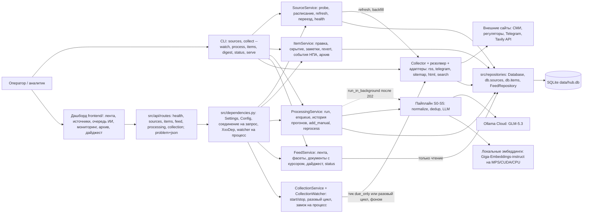
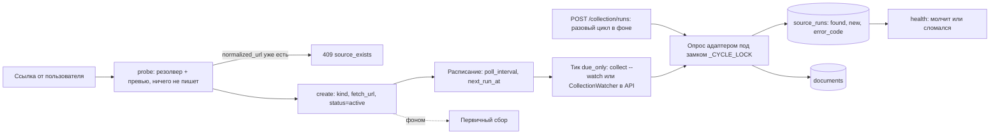
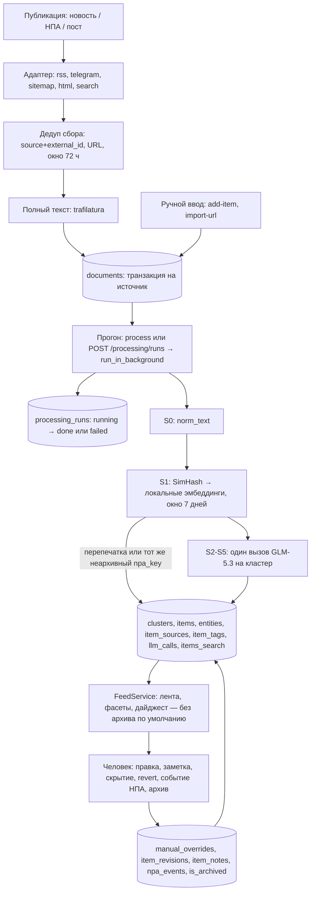
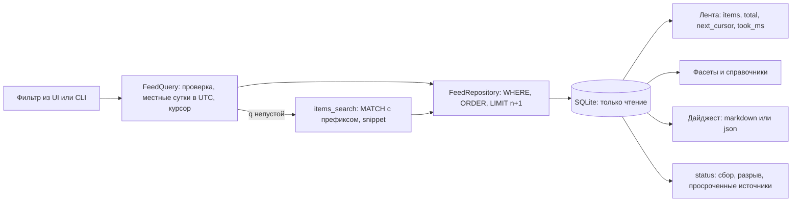

# Целевая архитектура (Статус на 06.09.2026. 02:00)

## Что должно быть:

- Основные компоненты;
- Поток данных от входящего материала до карточки в ленте;
- Синхронные и асинхронные части;
- Хранилища;
- Места вызова сервисов и интеграций;
- Участие человека и запасные пути.
- Диаграммы — Mermaid.

## Основные компоненты

- **Резолвер источника + адаптеры** (`src/sources/resolver.py`, `scraper_*.py`). Пользователь вводит один URL, а резолвер сам выбирает способ опроса:
  - `tavily://search?q=…` → search; любая другая не-http схема → manual (оба без HTTP-запроса);
  - `t.me/…` → telegram;
  - URL, разбираемый feedparser → rss; `<link rel="alternate">` или типовые пути (`/rss`, `/feed`, …) → rss;
  - `robots.txt` / `sitemap.xml` с `lastmod` → sitemap;
  - иначе → html (diff ссылок).
  - Пять адаптеров за одним интерфейсом `Adapter.fetch(source, state, client, *, now, since, backfill) -> FetchResult` возвращают единый `RawDocument`. У `manual` адаптера нет — его наполняют руками.
- **Поисковый источник Tavily** (`scraper_search.py`, обёртка `scraper_llm.py`). Источник kind `search` хранит не адрес, а запрос: `fetch_url = tavily://search?q=…&domains=…&days=N…`. Одинаковый запрос всегда даёт тот же источник. Каждое попадание становится документом (текст страницы после `clean_page_text`; если меньше 400 символов — фрагменты Tavily плюс trafilatura), а ответ Tavily — документом-дайджестом «Сводка: <запрос>» (один на запрос в день). Это дополнение к лентам, не замена: gov.ru западными API индексируется плохо, качество держится на `domains`.
- **Коллектор и полный текст** (`collector.py`, `fulltext.py`). Опрашивает включённые источники, отсекает дубли, дотягивает текст анонсов через trafilatura и пишет в SQLite. `HostLimiter` — не больше 2 одновременных запросов к одному хосту (gov.ru банит бурсты). Для kind `search` окно 72 ч не применяется — у запроса своё `days`. `collect_one(source, force=True)` опрашивает один источник на вызывающем потоке — так работает команда `search`.
- **Сервисы обработки и карточек** (`src/services/processing_service.py`, `item_service.py`). Слой Service разделён по одному признаку — зовёт ли метод модель.
  - `ProcessingService` — всё, что зовёт модель: `run()` (документы без карточки → карточки; каждый не-`dry_run` прогон записывается в `processing_runs`), `enqueue()` (открывает запись `running`; второй прогон рядом — 409 `processing_busy`), `get_run()`, `list_runs()`, `queue_status()`, `add_manual()`, `reprocess()`, `quality_summary()`. Функция `run_in_background(...)` — цель `BackgroundTasks` после `POST /processing/runs`. Без ключа LLM провайдер равен `None`, и карточки создаются деградированными.
  - `ItemService` — всё без модели: `get_item`, `edit_item`, `set_visibility` / `bulk_visibility`, `add_note`, `revert`, `revisions`, `add_npa_event` (статус из словаря двигает карточку только вперёд; любая другая строка — событие без смены статуса), `set_archived`, плюс `record_model_revisions`, которым пользуется и `ProcessingService`.
  - Бизнес-логики выше сервисов нет: CLI печатает результат, маршрут сериализует его через `response_model`.
- **Пайплайн S0–S5** (`normalize.py`, `dedup.py`, `pipeline.py`, `profile.py`).
  - S0 — чистка HTML и boilerplate, результат в `documents.norm_text`.
  - S1 — SimHash 64 бита по словесным 3-граммам плюс косинус по эмбеддингам среди кандидатов окна 7 дней; эмбеддинги — локальная модель (`embeddings.py`, `ai-sage/Giga-Embeddings-instruct`).
  - После прогона — вторая дедупликация (`clustering.py`): HDBSCAN по эмбеддингам саммари свежих карточек, результат — предложение «вероятный дубль — объединить?» на карточке, объединяет аналитик (`ItemService.merge`).
  - S2–S5 — один structured-output вызов на кластер: тип, саммари 3–5 предложений, сущности «кто / что / когда / последствия», приоритет с `relevance_score` и `reasoning`, теги. Профиль компании подставляется в промпт версионируемым фрагментом — именно он решает, что для компании `high`.
  - Шага S6 (проверка саммари на опору в оригинале) в коде нет: модуль удалён. Работает только семантический разбор ответа с одним корректирующим ретраем.
- **Провайдер модели** (`src/processing/llm.py`). Протоколы `LLMProvider` / `EmbeddingProvider`, реализация `OllamaProvider`. Ошибки разделены: `LlmConfigError` (401/403/404 — неверный ключ или тег) останавливает прогон; `LlmTemporaryError` (429/5xx/сеть) уходит в повторы и затем в деградацию. В HTTP-процессе провайдер один на процесс (`get_llm_provider()` под `lru_cache`); закрывает его `lifespan`. Эмбеддинги — отдельный провайдер (`src/processing/embeddings.py`, `get_embedder()`): по умолчанию локальная модель sentence-transformers, `embeddings.provider: ollama` возвращает облачный путь, `off` выключает.
- **Сервис источников и расписание** (`src/services/source_service.py`, `src/sources/scheduler.py`).
  - `SourceService`: `probe()` (резолвер + превью + проверка «такой уже есть» по `normalized_url`), CRUD, `pause`, `resume`, `soft_delete`, `restore`, `health`, `refresh` (внеочередной опрос, возвращает `SourceRun`).
  - `update` принимает `url` / `kind` / `fetch_url` — переезд через `_relocate`: адрес перерезолвируется, `fetch_state` сбрасывается, `next_run_at = now`, документы остаются на том же `source_id`. Дубль — 409 `source_exists`.
  - `run_backfill(...)` — цель `BackgroundTasks` после `POST /sources` (первичный сбор).
  - Планировщик: у источника свой `poll_interval` (15m / 1h / 6h / 24h) и `next_run_at`; «чья очередь» — один `SELECT` (`sources.due`), после опроса срок пересчитывается. Падающий источник опрашивается реже: `backoff_factor` растягивает интервал в `2^min(неудач, 4)` раз, первый успех возвращает обычный ритм. `should_pause` снимает с опроса совсем (`status = paused`, причина в `notes`) источник в `error` с 50 неудачами подряд и без успеха неделю — вечный `error` больше не требует ручного вмешательства, возврат штатным `resume`.
- **Сервис сбора из процесса API** (`src/services/collection_service.py`).
  - `CollectionWatcher` — daemon-поток, раз в `interval_seconds` зовёт `run_collection_cycle(due_only=True)` и хранит состояние (`running`, `busy`, `next_tick_at`, `cycles`, `last_error`).
  - `CollectionService` — то, что видит кнопка «Запустить автоматический мониторинг»: `status()`, `start()` (минимум 60 с; повторный старт — 409 `collection_running`), `stop()`, `ensure_idle()`.
  - `run_collection_cycle` / `run_collection_task` — один проход коллектора на своём соединении под замком `_CYCLE_LOCK`: тик и разовый цикл никогда не идут одновременно (кто второй — 409 `collection_busy`). Каждый цикл пишется в `collect_runs`.
- **Читающий слой ленты** (`src/services/feed_service.py`, `src/repositories/feed.py`). `FeedService` — только чтение: `items`, `facets`, `filters`, `documents`, `digest`, `status`. Ни записей в базу, ни модели, ни сети — на этом держится бюджет «лента быстрее секунды». Форма фильтра — `FeedQuery` / `DocumentQuery` (`src/models/queries.py`), одна на CLI и HTTP; строку запроса разбирает `src/api/query.py`. Весь SQL чтения живёт за контрактом `FeedRepository` (`SqliteFeedRepository`). С 05.09.2026: курсор есть и у `DocumentQuery` (keyset по `(published_at, id)` с отпечатком фильтра), а `FeedQuery.archived` (`exclude` | `include` | `only`) решает видимость архивных карточек. Отдельный сервис, а не метод `ProcessingService`, потому что ответственность другая.
- **HTTP-API** (`src/main.py`, `src/api/`).
  - `create_app()` — фабрика без экземпляра на уровне модуля: uvicorn получает `src.main:create_app --factory`, поэтому импорт в тестах не читает `.env` и не открывает базу.
  - `api_router` собирается из `routes/health.py`, `routes/sources.py`, `routes/items.py`, `routes/feed.py`, `routes/processing.py`, `routes/collection.py`. Маршруты — тонкие обёртки без бизнес-логики.
  - Литеральные пути `/items/facets` и `/items/bulk` объявлены раньше `/items/{item_id}`, поэтому порядок роутеров ничего не решает.
  - Ошибки — `application/problem+json` (RFC 7807, `src/api/problem.py`) с расширениями `code` и `details`, чтобы UI ветвился по коду, а не по тексту. Коды — иерархия `src/exceptions.py` без импортов фреймворка: `AppError(detail, details)` с атрибутами `status_code` / `code`, семейства `SourceError` / `ItemError` / `QueryError` и конкретные листья (400 `validation_error`, 404, 409 `source_exists` / `possible_duplicate` / `nothing_to_revert` / `processing_busy`, 422 `unsupported_source`, 502, 400 `invalid_cursor` и т.д.).
- **Связывание и конфигурация** (`src/dependencies.py`, `src/config.py`). Слои собираются в одном месте: провайдеры и псевдонимы `Annotated[..., Depends()]`; маршрут объявляет `service: SourceServiceDep` и сам `Depends(...)` не пишет. Конфигурации две: YAML-`Config` (замороженные dataclass'ы, домен — сбор, Telegram, Tavily, модель, пайплайн) и pydantic-settings `Settings` (параметры процесса из окружения и `<HUB_ROOT>/.env`).
- **Модели, репозитории и CLI** (`src/models/`, `src/repositories/`, `src/cli.py`).
  - `domain.py` — доменные dataclass'ы (включая `ProcessingRun`), `queries.py` — `FeedQuery` / `DocumentQuery`, `requests.py` — pydantic-схемы тел с `extra="forbid"`, `responses.py` — pydantic-схемы ответов с `from_domain()`. Сервисы и репозитории pydantic не импортируют.
  - `database.py` — фасад `Database`: соединение, PRAGMA, миграции по `PRAGMA user_version` (v6 — снос мёртвого `items_fts`, v7 — сбои документов и прогресс прогона, v8 — переезд заметок в `item_notes`), `ping()` для readiness и репозитории атрибутами (`db.sources`, `db.documents`, `db.items`, `db.source_runs`, `db.notes`, `db.tags`, `db.search`, `db.processing_runs`).
  - Реализации по агрегатам: `sources.py`, `documents.py`, `items.py`, `processing.py`, `feed.py`; ABC-контракты — `repository_interface.py`.
  - SQLite `data/hub.db` — единственное место состояния. CLI и HTTP равноправны и зовут одни и те же сервисы: `collect`, `sources …`, `search`, `discover`, `import-url`, `docs`, `process`, `items`, `item`, `edit`, `hide`, `unhide`, `note`, `revert`, `revisions`, `add-item`, `reprocess`, `npa-event`, `profile`, `quality`, `digest`, `status`, `serve`.
- **Сервис профиля компании** (`src/services/profile_service.py`). `list_profiles`, `get_profile`, `active()` (через `profile.resolve`), `save(name, payload)` — не правка на месте, а новая версия, `set_default`. Профиль целиком уходит в промпт, поэтому запись сюда — управление промптом, а не справочником; карточка помнит `profile_version`, которой получена. Раньше CRUD был только в CLI (`profile show | list | use | set`), а смена того, что считается `high`, — решение владельца продукта, а не того, кто ходит в терминал.
- **Выгрузка среза** (`src/services/export.py`, `src/api/routes/export.py`). `to_rss` (RSS 2.0 через `xml.etree`, `pubDate` по RFC 822) и `to_csv` (`;`, CRLF, BOM для Excel) поверх `FeedService.visible_slice` — той же основы, что у дайджеста: только `visible`, без архива и без заметок аналитика. Своего ядра у выгрузки нет, это тот же срез в другой сериализации. Канал уходит за пределы дашборда, а авторизации нет — поэтому фильтр строже ленты, а не мягче.
- **Фронтенд дашборда** (`frontend/`, Vue — `NewsFeed`, `SourcesPanel`, `ManualItemForm`, `DigestView`). Экраны рисуются поверх `/api/v1`, логики в них нет. Пять заглушек получили серверную часть 05.09.2026 плюс переезд источника. Без серверной части остались сохранение / расписание / рассылка дайджеста и аутентификация — это заявлено, а не забыто.

## Поток данных: от входящей публикации до ленты

*Единица потока — публикация (новость / НПА / пост Telegram-канала), а результат — карточка в ленте с категорией и приоритетом.*

- **Заведение источника.** Пользователь вставляет один URL. `probe()` гоняет его через резолвер и ничего не пишет в БД: возвращает тип, `feed_url`, превью 3–5 материалов, `already_exists` по `normalized_url` (три написания канала — `t.me/x`, `t.me/x/`, `t.me/s/x` — это один источник) и предупреждения (`paywall_suspected`, `bot_protection`, `empty_feed`, `no_dates`, `unsupported_source`). `create()` сохраняет источник со `status = 'active'`, `poll_interval` (подсказка по категории: регуляторы и Telegram — 1h, СМИ — 6h, ручной — 24h) и `next_run_at = now`. Повтор — 409 `source_exists`; адрес после мягкого удаления восстанавливается (`_revive`), потому что собранное привязано к старому `source_id`. Бюджет `probe` — до 10 с.
- **Сбор.** Каждый тик (15 минут по умолчанию) коллектор опрашивает включённые источники:
  - RSS — условный GET по ETag / Last-Modified;
  - Telegram — посты после курсора `last_post_id` (веб-превью — до 5 страниц `?after=`, MTProto — до `max_posts`);
  - sitemap — записи новее курсора `lastmod` (до 5 дочерних sitemap, 200 URL);
  - HTML — ссылки, которых нет в `seen_urls`;
  - search — один POST к Tavily: первый запуск / `--force` / `--backfill` спрашивают последние `days`, дальше `start_date` = день предыдущего прогона − 1 (перекрытие на сутки); `include_raw_content=text`, `include_answer=advanced` при `summary=1`, `country` и `language` из `config.yaml` (`language: ru` — иначе сводка приходит по-английски).
- **Дедуп, полный текст, сохранение.** Отбрасывается дубликат по `(source_id, external_id)` или URL (правило по URL не трогает документы без пути — «Сводку» и посадочные страницы). Первый запуск — материалы не старше 72 ч (`date_window_hours`); у kind `search` окно задаёт сам запрос. Недатированные остаются; не больше 50 новых на источник за проход (`max_new_per_source`). Полный текст дотягивается trafilatura (до 20 000 символов). Запись — одна транзакция на источник: документы + курсор + `fetch_state` вместе. Замеры: прогон 02.09.2026 — 17/17 источников, 268 документов, второй проход — 0 новых; прогон 03.09.2026 — 41 источник, 538 документов за первый проход (~7 мин 20 с), 759 уникальных URL после двух проходов. `scripts/happy_path_pr.sh` и `happy_path_gr.sh` отработали с кодом 0, повторный запуск PR идемпотентен.
- **Опрос по расписанию и история.** Чья очередь — решает `next_run_at`: `Collector.run(due_only=True)` берёт только включённые источники с пришедшим сроком и сдвигает `next_run_at`; смена интервала пересчитывает срок немедленно. Каждый опрос — строка в `source_runs` (время, `items_found`, `items_new`, `error_code`, текст ошибки); `sources health <id>` и `GET /sources/{id}/health` показывают её рядом с `consecutive_failures` и `last_success_at`. С 05.09.2026 тик `collect --watch` и тик `CollectionWatcher` идут с `due_only=True`; разовый `collect` и `POST /collection/runs` без `due_only` опрашивают всё включённое.
- **Запуск из дашборда.** Три кнопки:
  - «Запустить автоматический мониторинг» — `POST /collection/start` (`interval_seconds`, минимум 60): поднимает `CollectionWatcher`; «Остановить» — `POST /collection/stop`.
  - «Собрать сейчас» — `POST /collection/runs` (202, цикл в фоне; занято — 409 `collection_busy`).
  - «Обработать очередь ИИ» — `POST /processing/runs` (`limit`, `source_id`, `since`, `profile_id`, `force`): `enqueue()` открывает запись `running` (второй прогон — 409 `processing_busy`), ответ 202, дальше `run_in_background` закрывает запись `done` или `failed`.
  - Дашборд узнаёт результат опросом: `GET /processing`, `GET /processing/runs`, `GET /processing/runs/{id}`, `GET /collection`. Перезапуск процесса помечает все `running` как `failed` (`lifespan`); документы остаются в `unprocessed`.
- **Нормализация и дедуп.** `process` берёт документы без строки в `item_sources`, чистит текст в `norm_text` и ищет, к чему документ примыкает: сначала SimHash (расстояние Хэмминга ≤ 8; правка-перепечатка даёт 2–4, разные документы — от 18), затем косинус по эмбеддингам (порог 0.86) среди окарточенных документов окна 7 дней. Перепечатка не тратит вызов модели: она добавляется в `item_sources` существующей карточки и увеличивает `clusters.size`. Для НПА склейка по похожести запрещена — только по совпадению `items.npa_key`. После прогона — вторая дедупликация по саммари уже созданных карточек (HDBSCAN, без порога): группы попадают на карточки как предложение «вероятный дубль», объединение (`merge`) переносит `item_sources`, заметки и ручные теги и помечает поглощённые карточки `deleted`.
- **Саммаризация, категоризация, приоритизация.** Один structured-output вызов на кластер (схема уходит параметром `format` — битого JSON не бывает): тип, саммари 3–5 предложений, сущности, приоритет с обоснованием, теги. Ответ разбирается своим кодом; невалидный по смыслу возвращается модели один раз с указанием причины. Проверки каждого предложения на опору в оригинале нет (S6 удалён) — «в саммари нет фактов, которых нет в оригинале» держится на промпте и правке аналитика. Факт по каждому вызову пишется в `llm_calls` (модель, токены, латентность, статус). Длинные документы уходят обрезанным префиксом (не map-reduce — иначе ломаются `evidence_offsets`), карточка помечается и получает `confidence × 0.7`.
- **Запись карточки.** Одна транзакция на кластер: `clusters` → `items` → `entities` → `item_sources` → `item_tags` → `llm_calls`, для НПА плюс первое событие в `npa_events`. Всё, что записала модель, дублируется строкой в `item_revisions` с `source_of_change = 'llm'`. Повторный `process` без новых документов создаёт 0 карточек; `--force` перечитывает документы, но окарточенные идут через `reprocess`, а не плодят дубли.
- **Правки.** `item` показывает карточку целиком: источники, хронология НПА, заметки, теги, история правок, «что предлагает модель». Правка (`edit`, `PATCH /items/{id}`) помечает поле в `manual_overrides`, пишет «было/стало» в `item_revisions` с причиной (`hallucination` / `wrong_focus` / `wrong_priority` / `other`) — переобработка это поле больше не трогает. Скрытие, мягкое удаление, заметки, ручное добавление и `revert` работают одинаково из CLI и API. С 05.09.2026 из дашборда доступны событие хронологии НПА (`POST /items/{id}/events`) и архив (`POST /items/{id}/archive` / `unarchive`).
- **Чтение: фильтр → выборка → лента и фасеты.** Фильтр из CLI или строки запроса собирается в `FeedQuery` — единственную проверенную форму (тип, статус НПА, приоритеты «ИЛИ», теги «И», источники, даты, порядок `published | priority | processed`, `limit` 1–200; нечисловой `limit` — 400, а не 500). Голая дата — местные сутки по `api.timezone` (по умолчанию `Europe/Moscow`), переведённые в UTC; иначе «за сегодня» теряет первые часы московского утра. `SqliteFeedRepository` собирает условия, сортировку (материал без даты — в конец), `LIMIT n+1`; ответ несёт строки с `canonical_url`, `total` по срезу, `next_cursor` и фактический `took_ms`. Фасеты (`by_priority`, `by_type`, `by_source` до 20, `top_tags` до 15) считаются тем же WHERE отдельным эндпоинтом.
- **Постраничность курсором.** Курсор — ключи сортировки последней строки плюс отпечаток фильтра, всё в base64. При притоке ~600 документов в сутки смещение давало бы дубли и пропуски; курсор с чужим фильтром отклоняется как `invalid_cursor` (400). Замер: 6 страниц, 38 уникальных id без повторов.
- **Поиск шире карточки.** Запрос `q` идёт по строке `items_search`, куда склеены заголовок, саммари, теги, сущности и `norm_text` канонического документа. Текст разбивается на слова, экранируется и получает `*` (морфологии у `unicode61` нет — по `законопроект` FTS5 не находит «законопроекта», а по `законопроект*` находит). Найденная строка приходит со `snippet`.
- **Необработанное, дайджест, статус.** `GET /documents?unprocessed=true` и `docs --unprocessed` показывают собранное без карточки — материал доступен в пределах 15 минут, пока обработка догоняет. У документа нет ни приоритета, ни типа — такие фильтры отклоняются. С 05.09.2026 очередь листается курсором (`next_cursor`, keyset по `(published_at, id)`). Архивные карточки по умолчанию исключены; `archived=exclude|include|only` возвращает их. `POST /digest` и команда `digest` рендерят срез в markdown или json с группировкой по приоритету и ничего не сохраняют. `GET /status` показывает время последнего сбора, разрыв «документов / карточек / без карточки», источники по статусам и просроченные.

## Синхронные и асинхронные части

- **Сбор: пул потоков + запись в главном потоке.** Опрос идёт в `ThreadPoolExecutor` (`concurrency: 8`); рабочие делают только HTTP и разбор, вся запись в SQLite — в главном потоке по мере готовности (`as_completed`). Полный текст дотягивается отдельным пулом (до 8 потоков на источник) под лимитом 2 запроса на хост. Отдельного процесса-планировщика нет: тикает либо `collect --watch`, либо `CollectionWatcher`, а кого опрашивать, решает `next_run_at`.
- **Telegram MTProto: asyncio внутри пула потоков.** Telethon асинхронный, а коллектор — пул потоков. На прогон поднимается один фоновый event loop с одним клиентом; рабочие отдают работу через `run_coroutine_threadsafe`. Параллельные запросы ограничены `telegram.concurrency` (2), история канала — `request_timeout` (60 с), `flood_sleep_threshold` (60 с) ограничивает ожидание FloodWait. Клиент отключается в конце прогона; чтение пассивное — каналы не подписываются.
- **Синхронно для пользователя:** `sources probe` и `sources add` (основной запрос 30 с, пробы путей 8 с, превью — один запрос, бюджет 10 с), `sources refresh` и `search` (один запрос на вызывающем потоке), `import-url`, весь читающий слой и правка карточек (`items`, `item`, `docs`, `digest`, `status`, `edit`, `hide`, `note`, `revert`, `npa-event`, `quality`, выгрузки `/export/feed.xml` и `/export/items.csv`) — только БД, без модели и сети. Бюджет чтения — меньше секунды; факт виден в `took_ms` каждого ответа.
- **HTTP-слой синхронный, соединение живёт один запрос.** Обработчики — обычные `def`, FastAPI выполняет их в пуле потоков. Соединение открывает зависимость `get_database` с `yield` и закрывает после ответа; в `app.state` оно не хранится. `Database` открывает SQLite с `check_same_thread=False` — это смена потока между шагами, а не параллельный доступ. WAL включён; `busy_timeout` 5 с. Фон — три пути через `BackgroundTasks` (первичный сбор после `POST /sources`, прогон после `POST /processing/runs`, цикл после `POST /collection/runs`) и один поток (`CollectionWatcher`). Все фоновые задачи стартуют после ответа и открывают своё `Database`; провайдер модели — тот же кэшированный на процесс; ошибка фоновой задачи уходит в лог (и в `processing_runs.error`), но не роняет процесс. Тик при занятом замке `_CYCLE_LOCK` молча пропускается, разовый запрос получает 409.
- **Обработка: та же схема.** S0 и S1 — на главном потоке (нормализация, SimHash, один батчевый запрос эмбеддингов); вызовы модели — в `ThreadPoolExecutor` с `processing.concurrency = 2` (бережёт квоту облака). Записи — на главном потоке, одна транзакция на кластер. Ретраи синхронные: до двух повторов с экспоненциальной паузой (`llm.max_retries: 2`, `retry_backoff: 2 с`); таймаут запроса — 300 с при бюджете 15 с на публикацию.
- **Быстрый и медленный путь разведены по командам.** Быстрый — `collect`: документ в базе через секунды. Медленный — `process`: кластеризация и модель. Сбор от модели не зависит: при недоступной модели `process` всё равно создаёт карточки, только деградированные. Чтение модель не зовет вовсе.
- **Раздельные интервалы и отступ на сбоях.** У источника свой `poll_interval` из четырёх значений, а после неудач он растягивается вдвое за каждую (до 16×), чтобы лежащий сайт не дёргали каждые 15 минут и он не копил `source_runs` вхолостую. Тик берёт только тех, чья очередь пришла; интервал тика — от 60 с до любого (по умолчанию 900 с), он ограничивает частоту проверки расписания, а не опроса источника. Планируется: автозапуск обработки по факту новых документов — сегодня его запускает человек или cron.

## Хранилища

- **SQLite `data/hub.db`** — WAL, `foreign_keys`, `busy_timeout` 5 с, миграции по `PRAGMA user_version` (сейчас v8). Миграция применяется целиком или никак: `_apply` открывает `BEGIN IMMEDIATE`, выполняет скрипт по одному оператору (`sqlite3.complete_statement` не режет тело триггера), прогоняет python-донаполнение и ставит `user_version` в той же транзакции. `executescript` для этого не годится — он делает COMMIT перед запуском, и упавшая на середине миграция оставляла базу полусобранной, а следующее открытие падало на «duplicate column»; уже применённые `ALTER` теперь пропускаются по `PRAGMA table_info`. WAL выбран, чтобы дашборд читал, пока `collect --watch` пишет. Код — пакет `src/repositories/`. PostgreSQL и pgvector отложены осознанно: FTS5 заменяет GIN, а косинусы по окну кандидатов считает `numpy` одним умножением матрицы на вектор — векторный индекс на этих объёмах не окупается.
- **Таблицы:** `sources` (ввод пользователя + `kind` / `fetch_url`, `status`, `normalized_url`, расписание, `deleted_at`; `fetch_url` UNIQUE — повторный `search` находит существующий источник); `documents` (нормализованный `RawDocument`; `UNIQUE(source_id, external_id)`, индекс по URL; колонка `hidden` осталась с 1.1 и никем не выставляется); `fetch_state` (ETag, JSON-курсор адаптера, `last_error`, `consecutive_failures`, `last_success_at`); `seen_urls`; `collect_runs`. С v7 документ помнит и свой сбой обработки: `attempts`, `last_error`, `last_attempt_at` — иначе «упал» и «ещё не брали» неразличимы, и `process --only-failed` не на что опереть. `raw_html` по умолчанию не хранится.
- **Таблицы обработки:** `clusters`, `items` (карточка с приоритетом, флагами, `model_name` / `prompt_version` / `profile_version`), `entities`, `item_sources`, `npa_events`, `item_revisions`, `company_profiles`, `prompt_versions`, `llm_calls`. Плюс колонки в `documents`: `simhash`, `embedding` (`float32` BLOB), `norm_text` (`evidence_offsets` считаются именно по ней).
- **Таблицы управления:** `source_runs` (история опросов; ≈ 5 тыс. строк в сутки при 53 источниках, чистка отложена), `item_notes` (заметки аналитика, во внешние API не уходят), `item_tags` (теги с `is_manual` — источник истины при переобработке; `items.tags` — денормализованная копия для ленты). Переименования: `items.edited_fields` → `manual_overrides`, `items.is_hidden` → `visibility` (`visible` / `hidden_feed` / `hidden_digest` / `deleted`) плюс `hidden_reason` и `origin`, `sources.enabled` → `status`. Индексы: `sources(next_run_at) WHERE status='active'`, уникальный `sources(normalized_url)` среди неудалённых, `item_revisions(item_id, field, created_at DESC)` — по нему `revert` и «модель предлагает другое» в бюджете < 1 с.
- **Поисковый индекс:** виртуальная таблица `items_search` (FTS5, `unicode61`, `prefix='2 3 4'`), одна строка на карточку, `rowid = items.id`; в строку склеены заголовок, саммари, теги, сущности и `norm_text`. Триггеров нет: строка перестраивается целиком (`DELETE` + `INSERT`) в семи местах двух сервисов (`ProcessingService`: создание, присоединение, привязка НПА, `add_manual`, `reprocess`; `ItemService`: `edit_item`, `revert`). При миграции индекс наполняется `SearchRepo.rebuild_all`. Индекс один: старая `items_fts` (v2) вместе с тремя триггерами снесена миграцией v6 — она обслуживала только недостижимый путь `SqliteItemRepository.list(query=…)`, а триггеры дорожали каждую запись карточки.
- **Прогоны обработки:** таблица `processing_runs` — строка на не-`dry_run` прогон: `started_at`, `finished_at`, `status` (`running` | `done` | `failed`), `trigger` (`cli` | `api`), `params` (JSON), счётчики отчёта, `elapsed_s`, `error`. Очередь ИИ видна из дашборда, потому что лежит в базе, а не в памяти; единственность прогона — строка `running`, а не замок. С v7 прогон отчитывается и по ходу дела: `processed` (документов пройдено из `documents`) и `heartbeat_at` обновляются после каждого кластера, поэтому кнопка «Обработать очередь» показывает долю, а зависший прогон виден по возрасту биения.
- **Архив — отдельный флаг:** `items.is_archived` переключается `ItemService.set_archived`, каждое переключение — ревизия от человека. Уникальность `npa_key` держит частичный индекс `WHERE npa_key IS NOT NULL AND is_archived = 0`: архив снимает ключ, и следующая публикация о том же акте заводит новую карточку. Лента, фасеты и дайджест исключают `is_archived = 1` по умолчанию.
- **Сессия Telegram — второй файл SQLite.** `data/<session_name>.session` хранит ключ MTProto-сессии — это равно доступу к аккаунту, файл в `.gitignore`; `api_id` / `api_hash` живут в `.env`. Сессия кэширует резолвинг каналов.
- **Планируется:** архивация по расписанию (сейчас только ручная и массовая), чистка `source_runs` и `processing_runs` (растут без ограничения), заполнение `has_divergent_opinions` (колонка есть, признак не вычисляется). Колонка `items.analyst_note` осталась в схеме ради совместимости ответа и с v8 всегда пуста: заметки живут в `item_notes`.
- **Внешние хранилища не нужны:** вложения — ссылки (`attachments`), кэш страниц — сама `documents`. PostgreSQL — на выбор при выходе за прототип, критерий — несколько писателей/сервисов.

## Места вызова сервисов и интеграций

- **Внешние сайты.** Пул `sources.json` собран из `context/sources_for_company.md`: 41 источник — 14 СМИ (RSS: CNews, TAdviser, Коммерсантъ, ТАСС, Lenta.ru, Телеспутник, Habr, Ведомости; sitemap: Кабельщик), 9 регуляторов (pravo.gov.ru × 3, government.ru, Роскомнадзор, ФНС — RSS; РФРИТ — sitemap; ФСБ — HTML-diff), 16 зеркал `t.me/s/<канал>`, 2 поисковых запроса; 32 включены. Всё без ключей, кроме Tavily и Telegram. Один `httpx.Client` на прогон, браузерный User-Agent, `Accept-Language: ru`, таймаут 30 с, до 5 редиректов; ошибки возвращаются в `FetchResult.error`. Ограничение: gov.ru и часть СМИ блокируют зарубежные IP.
- **Telegram: два транспорта, один kind.** MTProto (Telethon, личный аккаунт), если есть файл сессии, и веб-превью `t.me/s/<канал>` в остальных случаях; выбор задаёт `telegram.mtproto: auto | off | only`. Нумерация постов общая, курсор помнит транспорт (`cursor.transport`) — смена транспорта проходит без дублей. MTProto добавляет каналы с выключенным превью и имена вложенных файлов; сами файлы не скачиваются, в `attachments` идут ссылки.
- **Tavily.** Ключ `TAVILY_API` из `.env`. (1) `discover` — поиск кандидатов в источники; документов не создаёт. (2) Источники kind `search` — сохранённый запрос опрашивается наравне с лентами: до 20 результатов, `days` / `country` / `language` из `config.yaml`. Каждый опрос стоит кредиты, поэтому два засеянных запроса выключены по умолчанию. Нет ключа — ошибка в `fetch_state` конкретного источника, а не падение прогона. Планируется: Yandex Search API и обогащение карточки («кто ещё писал о законопроекте»).
- **Ollama Cloud.** `https://ollama.com`, модель `glm-5.3:cloud`, ключ `OLLAMA_API_KEY` из `.env`; эмбеддинги — локальная модель (`embeddings.provider: local`), облачные `embeddinggemma` (768) тем же клиентом только при `embeddings.provider: ollama`. Зовётся только из `process` и `reprocess`, никогда из чтения ленты. Вход — профиль компании плюс заголовок, источник, дата и `norm_text` (до `max_chars = 12000`). `analyst_note` в промпт не передаётся конструктивно. Смена провайдера — новая реализация `LLMProvider` и другой `model` в конфиге, пайплайн не меняется.
- **HTTP-API — точка интеграции.** `/api/v1/sources`, `/api/v1/items` (лента, правка, скрытие, заметки, ревизии, revert, ручное добавление, bulk, события НПА, архив), читающие маршруты (`/items/facets`, `/filters`, `/documents`, `/digest`, `/status`), `/api/v1/processing` (включая `GET /processing/quality` — карточки, очередь и вызовы модели по этапам и суткам), `/api/v1/collection`, `/api/v1/profiles`, `/api/v1/export/feed.xml` и `/export/items.csv`, `/health`, `/health/ready`. Массовые правки: `POST /items/tags/bulk` и `POST /items/archive/bulk` — тегинг и архивация пачкой, раньше это были двадцать одиночных PATCH. Ошибки — problem+json с машинным `code` (новые: `processing_busy`, `run_not_found`, `collection_running`, `collection_not_running`, `collection_busy`, `profile_not_found`). Читающие маршруты не зовут ни модели, ни Tavily, ни сайтов. Во внешний мир — семь путей, все по явному действию пользователя: `POST /sources/probe`, `PATCH /sources/{id}` с новым адресом, фоновый первичный сбор, `POST /sources/{id}/refresh`, фоновые циклы сбора и два платных пути к модели (`POST /items` с `run_llm: true` и `POST /processing/runs`). Авторизации нет (ИБ вне скоупа), но автор изменения пишется строкой (`sources.created_by`).
- **Связывание слоёв — только `src/dependencies.py`.** Все провайдеры и псевдонимы в одном модуле: `SettingsDep`, `ConfigDep`, `PathsDep`, `DatabaseDep` (соединение на запрос через `yield`), `LLMProviderDep` (один на процесс, `None` без ключа), `TavilyKeyDep`, `CollectorDep`, `CollectionWatcherDep`, сервисные Dep'ы. CLI собирает те же сервисы руками — второй потребитель того же слоя, минуя FastAPI.
- **Две конфигурации.** `Settings` (pydantic-settings) — параметры процесса: `app_name`, `environment`, `debug`, `api_prefix`, `host`, `port`, `docs`, `cors_origins`, `log_level`, `hub_root`; читаются из окружения и `<HUB_ROOT>/.env` (файл выбирается по `HUB_ROOT` до создания `Settings` — строка `HUB_ROOT=` внутри `.env` не читается). `Config` (замороженные dataclass'ы) — домен: сбор, Telegram, Tavily, модель, пайплайн; `ApiConfig` держит только `timezone`, `ProcessingConfig.category_weights` задаёт порядок очереди обработки (НПА от регулятора вперёд ленты СМИ). Поле со значением по умолчанию через фабрику больше не считается обязательным при разборе секции. Секреты в `Settings` не моделируются: имена переменных задаёт YAML, читает `utils.load_env_secret`.
- **Docker и compose.** `src/Dockerfile` — многостадийная сборка на `uv`, пользователь `app` без root, `HEALTHCHECK` дёргает `/api/v1/health/ready`. `docker-compose.yaml` — сервисы `api` и `frontend`: `HUB_ROOT=/app`, `.env` как необязательный `env_file`, тома `./data`, `./src:ro` с `--reload` для разработки, `./config.yaml` и `./sources.json` только на чтение. Отдельного воркера нет: сбор и обработка запускаются из процесса `api`. `collect --watch` рядом с включённым наблюдателем API даст два независимых тика — так делать не стоит.
- **Проверки живости (`src/services/health.py`).** `GET /health` — liveness: всегда `ok`, без ввода-вывода. `GET /health/ready` — readiness: `Database.ping()`; хранилище не отвечает — `degraded` и 503 с тем же телом. Это не замена `GET /status`: тот — про продукт, эти — про процесс.
- **Отдельные адаптеры (планируется):** regulation.gov.ru (Next.js: нужна RSS-подписка или Open Data API), СОЗД Госдумы (публичного API нет), reestr.digital.gov.ru (только поиск). С оговоркой на сеть: digital.gov.ru, ФСТЭК, ComNews, RSpectr, Broadcasting.ru — все в `excluded` с причиной. publication.pravo.gov.ru закрыт штатным RSS-адаптером (`/api/rss?block=…`, только http).

## Участие человека и запасные пути

- **Резолвер деградирует ступенями:** ленты нет → sitemap → diff ссылок HTML; недоступный сайт всё равно добавляется как html с пометкой. Приватная Telegram-ссылка и не-http схемы — как `manual` без HTTP. `sources add --kind --fetch-url` закрепляет адрес руками; `sources resolve` перепроверяет и сбрасывает курсор.
- **Сбой одного источника не останавливает прогон:** ошибка пишется в `fetch_state.last_error` / `consecutive_failures` и строкой в `source_runs` с машинным `error_code`. `sources pause` выключает шумный, `--force` / `--backfill` перечитывают, `refresh` опрашивает вне очереди. Лежащий сайт сам уходит на разрежённое расписание, а после недели молчания — в паузу с причиной в `notes`. Сайты, которые резолверу не по зубам, живут в `excluded` с причиной.
- **Удаления нет нигде.** `sources remove` — `status = 'deleted'` и `deleted_at`; документы и карточки остаются, `restore` возвращает в работу; `--purge-items` прячет карточки в `hidden_feed`. У карточки то же через `visibility`: `hidden_feed` убирает из ленты, `hidden_digest` — только из выгрузки, `deleted` — мягкое удаление. Из ленты по умолчанию уходят `hidden_feed` и `deleted`; `--include-hidden` возвращает всё; дайджест исключает `hidden_digest` и `deleted` всегда. Скрытие не влияет на дедуп: скрытая карточка остаётся якорем кластера.
- **Telegram: вход руками один раз.** `python -m src telegram login` (телефон, код, 2FA), `status`, `logout --yes`. Без сессии сбор продолжается через веб-превью. В `auto` сбой одного канала откатывает на превью только его; сбой уровня сессии защёлкивается на прогон; `only` превращает всё в ошибку, `off` не обращается к MTProto.
- **Ручной ввод — полноправный источник.** Встроенный источник «Ручной импорт» (`kind=manual`, адаптера нет, `collect` пропускает), `import-url` и `add-item` / `POST /items` для материала, которого в источниках не было. Материал без ссылки валиден. Дубль ловится по нормализованному URL, потом по SimHash и возвращается как 409 `possible_duplicate` с найденной карточкой; настоять можно `--force`. Карточка получает `origin = 'manual'`; без модели — деградированная, но не теряется.
- **Человек ранжирует, система подсказывает.** Модель даёт уровень «релевантно / нерелевантно» и обязательный `reasoning` — по нему видно, почему карточка наверху. Ошибки асимметричны: пограничная релевантность (0.35–0.5) или `confidence < 0.5` поднимают приоритет на ступень и никогда не понижают — пропустить критичное дороже, чем показать лишнее.
- **Правка аналитика сильнее пересчёта.** `edit` меняет заголовок, саммари, тип, приоритет, теги, статус НПА; изменённое поле попадает в `manual_overrides` и следующий `reprocess` его не трогает (снять защиту — только `--drop-human-edits`). Ручные теги переживают переобработку (`item_tags.is_manual`). Событие НПА двигает статус только вперёд по словарю «анонс → разработка → внесён → рассмотрение → принят → действует → архив»; статус не перезаписывает правку человека и не ставится на новость. Любая другая строка — событие со сроком. Смена профиля архив не пересчитывает: только явный `reprocess`.
- **Правка обратима, заметка — не саммари.** Всё, что пишет модель, ложится в `item_revisions` с `source_of_change = 'llm'`, поэтому `revert --field …` возвращает последнюю версию модели одним действием, а на карточке видно «модель предлагает другое». Если поле модель не трогала — честный 409 `nothing_to_revert`. Заметки живут в `item_notes` с автором и не уходят ни в один внешний вызов.
- **Архив — конец жизни карточки без удаления.** `archive` / `unarchive` переключают `is_archived` и пишут ревизию; повторный архив — no-op; `POST /items/archive/bulk` делает то же пачкой (после отправки дайджеста это один жест). Архивная карточка уходит из ленты, фасетов и дайджеста, но не из базы: `archived=include|only` возвращает её. Для НПА архив — «дело закрыто»: `npa_key` освобождается, новая публикация о том же акте начинает новую карточку. Расписания нет.
- **Запасные пути обработки.** Модель недоступна или ответ дважды не прошёл проверку → экстрактивный baseline: первые предложения, приоритет «средний», `confidence 0.3`, флаг `degraded` — лента не пустеет. Локальная модель эмбеддингов не загрузилась или вернула не ту размерность → `LlmConfigError`, прогон остановлен; не хватило памяти ускорителя → ошибка в логе и S1 в этом прогоне по URL и SimHash (тихого отката больше нет). Неверный ключ модели → прогон останавливается с понятным сообщением. Превью не удалось → `probe` отвечает с предупреждением, источник можно завести вслепую. Вложения не читаются вовсе. Флаг `needs_review` теперь честный: его ставит тот же признак, что поднимает приоритет — пограничная релевантность (0.35–0.5) или `confidence < 0.5`, в том числе когда приоритет уже `high` и поднимать нечего. Раньше признак считался, но никуда не записывался и флаг всегда оставался нулём. `entities.evidence_start/end` заполняются первым дословным вхождением значения в `norm_text`; перефразированная сущность оставляет их пустыми — честное отсутствие лучше выдуманного диапазона. Прогон из дашборда упал → `failed` с ошибкой, документы остались в `unprocessed`; перезапуск API посреди прогона закрывает запись как `failed`; без ключа `GET /processing` отвечает `llm_available: false`, и прогон всё равно можно запустить. Тик наблюдателя упал → `last_error` в `GET /collection`, следующий тик по расписанию.
- **Что остаётся ручным (осознанно).** Запуск прогона обработки (в том числе повтор сбойных — `process --only-failed` и `only_failed` в теле запуска); включение наблюдателя после перезапуска API (состояние не хранится); архив; сохранение, расписание и рассылка дайджеста; аутентификация (ИБ вне скоупа, автор пишется строкой).
- **Запасные пути чтения.** Пустой срез — это 200 и `items: []`, а не 404: «ничего не нашли» отличается от «сервер сломался», а `/status` объясняет пустоту (сбор идёт, обработка отстала). Пока обработка догоняет, материал не пропадает: `/documents?unprocessed=true`. Ошибки фильтра не молчат: `limit` вне 1–200 — `validation_error`, курсор с чужим отпечатком — `invalid_cursor`; заметки попадают в выгрузку только по явному `include_notes`.